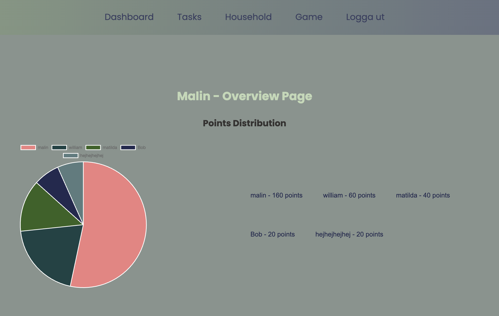
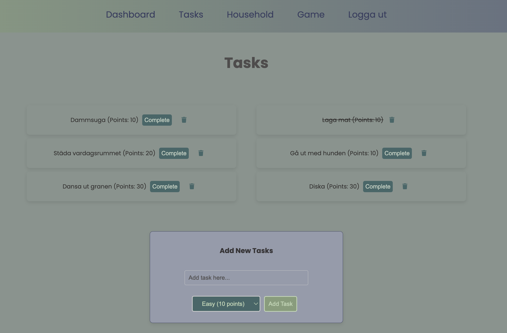
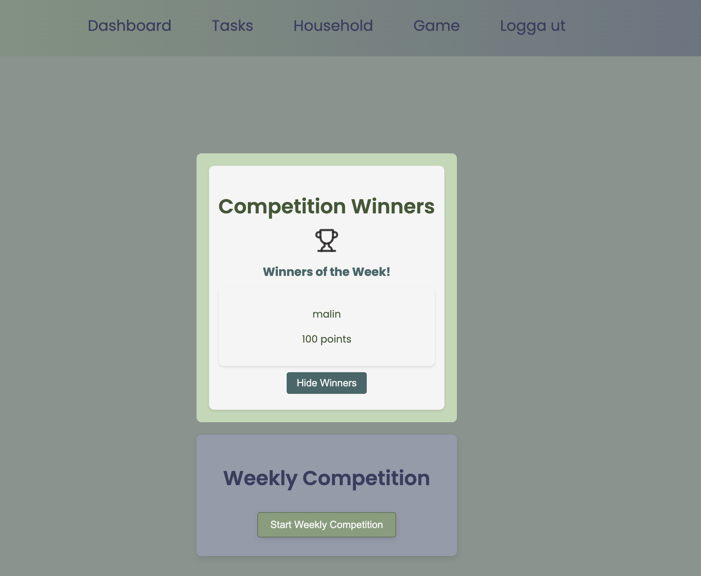

Household Tasks Game - Web Application

Description
This project is a web application designed to turn household tasks into a game. Users can add tasks, assign difficulty levels (easy, medium, or hard), and complete them to earn points. Tasks are visualized using charts to display progress and percentage contributions. When a game starts, users have one week to complete tasks, after which they receive a summary report of the household's performance, with a "winner" crowned based on points. The goal of the project is to make the distribution of household tasks transparent, fair, and motivating while providing insights into the household's overall productivity.

Tech Stack
Frontend: [React](https://reactjs.org/)
Used to build a fast, interactive, and responsive user interface with reusable components.

Backend: [Superbase](https://supabase.com/)
Provides authentication, database management, and API services with minimal setup using PostgreSQL.

Database: [PostgreSQL](https://www.postgresql.org/) (via Supabase)
Used for storing user data, household groups, tasks, and points.

Visualization: [Chart.js](https://www.chartjs.org/)
Creates dynamic charts to show user progress and compare contributions among household members.

Styling: [SASS](https://sass-lang.com/)
Ensures a modern, responsive design with support for custom styling.

Core Features
Authentication: Login and registration using Supabase Auth

Task Management: Users can create, edit, and delete tasks, assign difficulty levels, and earn points.

Progress Visualization: Charts display task progress and user contributions.

Weekly Reports: Summarizes household performance and announces a winner.

Pages
Login/Register: User authentication.

Your Account/Dashboard: Overview of user details and household.

Add/Complete Tasks: Create tasks or mark them as done.

Household: Charts display task distribution, task history, and total points of household members.

Weekly Report: Summarizes performance and announces the winner.

Installation
To run this project locally, follow these steps:

Clone the repository:

bash
Copy
git clone https://github.com/mallrosen/household-tasks-malin.git
cd household-tasks-game
Install dependencies:

bash
Copy
npm install
Set up Supabase:

Create a Supabase project at Supabase.

Replace the Supabase URL and API key in the project with your own credentials.

Run the application:

bash
Copy
npm start
Open the app:
The application should now be running on http://localhost:3000.

Usage
Register/Login: Create an account or log in to an existing one.

Create/Join Household: Create a new household group or join an existing one.

Add Tasks: Add tasks, assign difficulty levels, and earn points upon completion.

Track Progress: View progress and contributions through interactive charts.

Weekly Summary: Check the weekly report to see the household's performance and the winner.

## Screenshots

### Household Page!

*Household Page som visar poängfördelning mellan hushållsmedlemmar.*

### Tasks

*Sidan för att lägga till och slutföra uppgifter.*

### Competition Winners!

*Veckovinnare och möjlighet att starta en ny veckotävling.*

Reflections and Lessons Learned
Throughout the project, I gained valuable insights and improved my technical and organizational skills:

Supabase: This backend solution proved user-friendly and powerful, though it required time to master its features. I now have a better understanding of database management.

SASS: Styling the application was both a challenge and a highlight. Using SASS pushed me to adopt better practices for scalable and maintainable CSS.

Time Management: Coding tasks often took longer than expected. I learned the importance of patience and breaking tasks into manageable chunks.

Taking Breaks: When stuck on complex problems, stepping away was crucial to regaining clarity. Overworking led to confusion, especially when managing multiple files.

Structure and Consistency: Maintaining a consistent file and folder structure is essential in programming. I realized areas where I could improve my organizational habits and save my work more often.

Adaptability: Every solved problem introduced new challenges, emphasizing the iterative nature of software development. Embracing this mindset helped me stay resilient and solution-focused.

License
This project is licensed under the MIT License. See the LICENSE file for details.